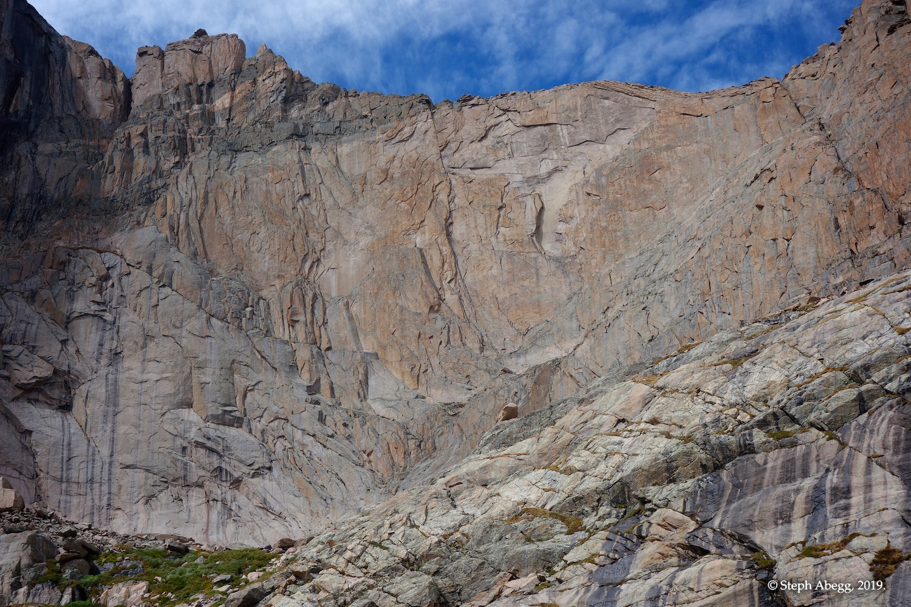

# Route: Directissima (5.10b, 4p)  

### A short day sunny climb at 13,000 feet, or a nice link-up into a route on the Diamond.

===========================

This PDF was generated from Steph Abegg's beta on her excellent website: [stephabegg.com](http://stephabegg.com) 

[Direct link to original trip report.](https://sites.google.com/stephabegg.com/colorado/tripreports/cvw-directissima)

===========================

## Route Overlay

# Trip Report #1 (September 2019)
### (first time climbing Directissima)  

Enjoying excellent rock and views on Directissima.

INTRO

Chasm View Wall is the steep wall of granite that lies above Mills Glacier just right of the North Chimney on the approach to the Diamond. If it were not overshadowed by the Diamond, Chasm View Wall would be a target crag. The wall has several 4-6 pitch routes on steep, high-quality granite, with an easy approach and descent. And because the cliff bends from east to south-facing, it receives sunlight well into the afternoon (unlike the Diamond which goes into the chilly shade by late morning). Chasm View Wall is a good introduction to the more demanding Diamond climbs or a good short-weather-window objective. 

Directissima is one of the more popular routes on Chasm View Wall. At 10b, it is one of the easiest routes up the wall, and also has some of the best rock. Implied by its name, Directissima takes a direct route up the vertical, right-facing flake-dihedral system up the center of the wall. The rock is excellent and featured, and the climbing style is athletic, with a few slightly-burly wide sections (two #4 cams are nice to have on this route). I had eyed this route for awhile, usually remembering its presence while sitting at a chilly belay high on the Diamond gazing at the golden expanse of Chasm View Wall basking in the sun below. 

I finally got around to climbing this route on a chilly weekend in early September. The weather was forecasted to be mostly sunny, but quite windy with the temperatures in the 40s. Most of my friends had decided to stay at lower elevation spots like Eldo or Boulder Canyon. But this meant a chance to be the only party  on a more popular route in the alpine. My newfound climbing friend Giles was psyched to head up into the alpine. Directissima on Chasm View Wall seemed like a good choice. I've always thought that a route on Chasm View Wall would make a great link-up with a route on the Diamond, using the Chasm View Rappels to get onto Broadway Ledge and avoiding the North Chimney approach altogether. So Giles and I got an early start, to give ourselves the possibility of linking Directissima with an uncrowded Casual Route if the conditions were pleasant enough to do so.

Giles and I had a fun day climbing Directissima. One of the perks of this route is that it provides an un-obstructed view of the Diamond, so you can watch the swarm of climbers over there. It was an exciting (terrifying might be a better word) day in the North Chimney, as we watched three separate rockfall incidences, with the last coming within mere feet of obliterating a climber who had just started up the chimney. This party was so shaken that they bailed on the spot. (In fact, the previous weekend my climbing partner Nate and I had weathered a similar near miss from human-generated rockfall from a roped party in the North Chimney above us. It's always a tad frustrating to witness rockfall incidences in the North Chimney, since kicking off rocks is quite avoidable if you are just careful. Granted, it's loose, but it's not so loose that you cannot navigate upwards on reasonably-solid rock. One rockfall incidence on this particular day was generated by a party who dragged their rope across the loose 3rd class terrain at the top of North Chimney. I don't like to introduce too many rants into my trip reports, but if you are roped up to cross the top of the North Chimney, you probably shouldn't be trying to climb the Diamond. You'll likely bail on your route anyway, and your day would have been better spent climbing something else (like a route on Chasm View Wall, for instance!) and everyone would be safer for it. My two cents at least...) Anyway, Giles and I counted 8 or so parties on the Diamond, most on the Casual Route (of course). Over the course of our climb, we watched all 8 parties bail. We later heard that the Casual Route was pretty wet from a rainstorm that had passed through the night before. Plus, it was admittedly pretty cold and windy up there. The final party on the wall was bailing off Yellow Wall as we topped out on Directissima, so we took the hint and decided to forgo any plans to follow up Directissima with a climb on the Diamond, even though we had plenty of time still to run up the Casual Route. Instead, we enjoyed a relaxing romp down the Camel Gully and back to the trailhead.

Overall, Directissima was a fun 4-pitch adventure at 13,000 feet. Thanks Giles for being an excellent partner! I'll be back again to link it into a route on the Diamond. 

Update: The following week I returned to climb Red Wall, which is just a couple of hundred feet left of Directissima on Chasm View Wall. I thought it was every bit as good as Directissima!

The following page provides an overlay and a pitch-by-pitch photo trip report for our climb. Enjoy!

## PITCH BY PITCH PHOTOS

## Approach
Approach Chasm View Wall via Chasm View Lake. From the right edge of the Mills Glacier, scramble (mostly 3rd, some 4th) up and right along the long ramp system, continuing up and right to the highest ledges at the bottom of the Directissima corner system. 
1. Approaching Chasm View Wall.

2. Chasm View Wall. The approach ramp cuts gently up across the bottom of the wall. Directissima  follows the obvious corner system. We had no snow to deal with, but earlier in the season you would likely have a snowfield at the right edge of the Mills Glacier between you and the ramp.

3. 3rd/4th classing the approach ramp.

4. The Diamond from Chasm View Wall. Looks a tad wet up there today....

## Pitch 1

5.8. Climb a left-leaning right-facing dihedral system to a ramp beneath a small roof. There is an old bolt and a nice horn here.

5. Looking up from the base of Pitch 1.

6. "Flower filled crack" on Pitch 1.

## Pitch 2

5.9. Climb straight up past the right end of the roof, pass through a slot, and continue up the dihedral to a belay at a bolt beneath a flake-roof.

7. Looking up from the base of Pitch 2.

8. The upper section of Pitch 2. As you can see from the photo, the route has an awesome position.

9. An old bolt at the belay location at the top of Pitch 2.

## Pitch 3

5.9+. Climb over the overhanging flake and continue up into a chimney. The chimney narrows into a squeeze and then a wide crack. Pull around a flake and continue up featured terrain to a small ledge. The chimney/squeeze/OW is the strenuous crux of the route. This pitch makes a good argument for not wearing packs on this route (Giles had brought a pack, while I had not; our deal ended up being that he would lead the pitch and I would dangle his pack below me as I followed the pitch).

10. The overhanging flake at the start of Pitch 3.

11. The chimney. 

12. The chimney/squeeze is a graveyard of old-style #4 cams. There were three of them stuck  within a 15 foot stretch.

## Pitch 4

5.10b. Climb a dihedral to a roof and make a committing move to a good jam (crux). Follow a crack through featured rock to the top of the wall. 

13. Giles starting up the fun corner at the start of Pitch 4. 

14. The featured crack on the upper  half of Pitch 4.

## Top!
The route tops out on ridge just below Chasm View. (As I mentioned in the intro, an excellent day out would be to next rap the Chasm View Rappels onto Broadway Ledge and then climb a route on the Diamond. We had talked about doing this, but we sensed the conditions on the Diamond were non-ideal when we watched every  single party bail off their route during the course of our climb.)

15. Packing up for the descent at the top of the route.

## Descent
If you brought your gear up, the easiest way out is to hike down towards the Boulderfield, intersect the trail, and hike out. Alternatively, return to Chasm Lake Cirque via The Camel Gully and hike out. We descended via Camel Gully in order to check the gully out.

16. The entrance to the Camel Gully is just right of this obvious "Camel" feature on the ridge.

17. Starting down the Camel Gully.

18. A view back up the Camel Gully.

19. A view of The Diamond and Chasm View Wall. As this photo clearly indicates, the Diamond goes into the shade much sooner than Chasm View Wall, making Chasm View Wall a good choice for cooler days.

20. Zoomed in on Chasm View Wall. If it weren't overshadowed by the Diamond above, this awesome chunk of rock would probably be swarming with climbers on a typical summer day.

21. Giles taking a room tour at the HIlton bivy boulder.

22. Some good looking cragging potential just above Chasm View Lake. A good adventure alternative for those who bail on the Casual Route.....

