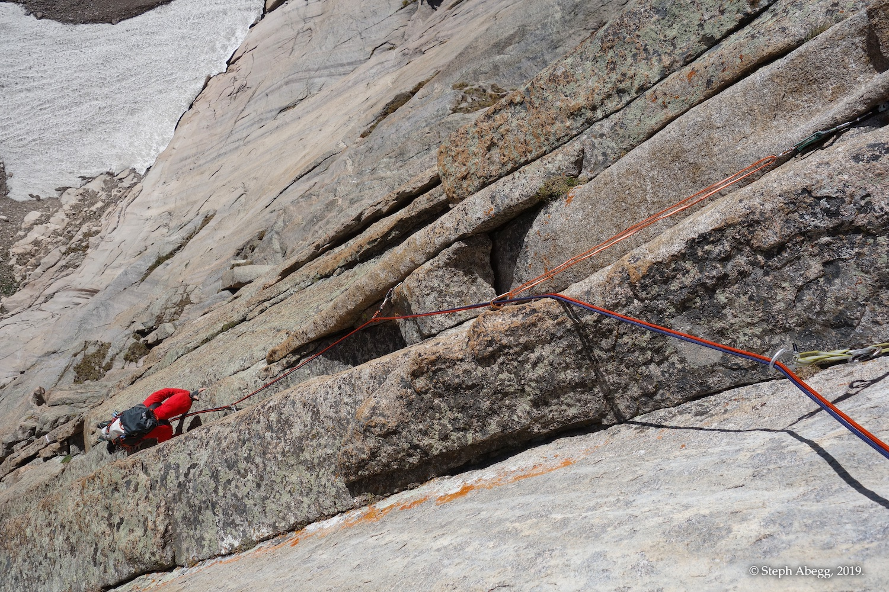
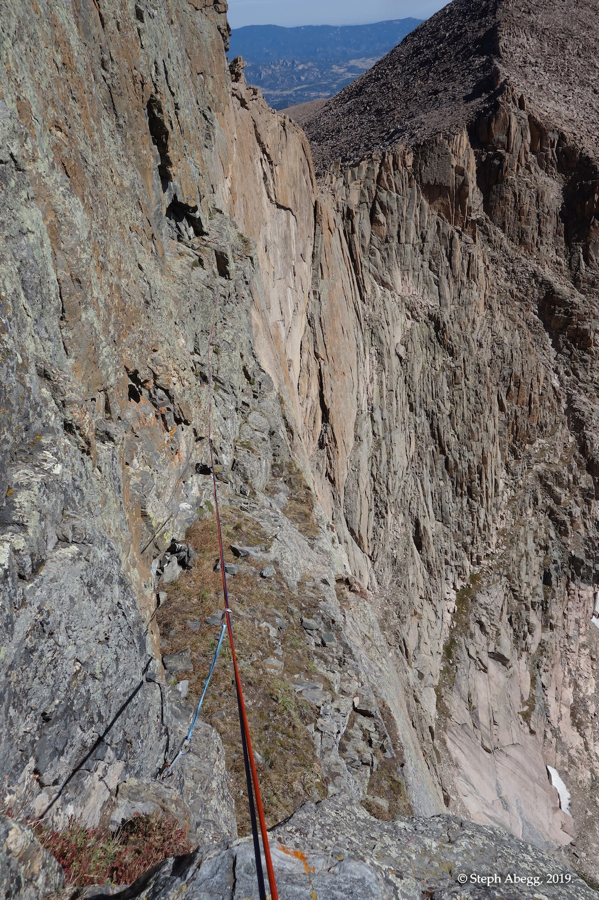

# Route: Red Wall (5.10b, 6p)
===========================

This PDF was generated from Steph Abegg's beta on her excellent website: [stephabegg.com](http://stephabegg.com) 

[Direct link to original trip report.](https://sites.google.com/stephabegg.com/colorado/tripreports/cvw-redwall)

===========================

### A short day climb at 13,000 feet, or a nice link-up into a route on the Diamond.

INTRO
-----

My sister Jenny was passing through Boulder, so we set aside the weekend to do some climbing together. She had never climbed on the Diamond, and being that the Diamond is my favorite chunk of rock to climb in the area (or perhaps anywhere), we decided that the Casual Route would be a fun objective (I had climbed the Casual Route the previous summer, but it had been wet so I had always wanted to come back and climb it again when dry). But the Casual Route can be quite a conga line on the weekend. So we decided a good plan would be to approach The Diamond via a route on Chasm View Wall. This way we would be guaranteed at least one good route, and hopefully it would put us behind the morning rush to the base of the Casual Route.

We climbed the Red Wall route on Chasm View Wall. I had climbed Directissima the previous weekend, and had been eyeing Red Wall, since it sounded like a route on par with the high quality and low 5.10 difficulty of Directissima. Red Wall climbs a series of right-facing flake-dihedrals a couple of hundred feet left of Directissima. Jenny and I enjoyed this route, finding the climbing to be continually steep and interesting and the rock is very good. As had been the case the previous weekend, we were the only party on the entire wall, despite the sunny aspect and mellow approach. For comparison, there were half a dozen parties huddled at the base of the Casual Route, dodging icefall and waiting their turn.

One unique part of the day was watching giant icicles slough off the upper walls of the Diamond as they were melted off by the sun's light. We were glad to not be one of the 10 or so parties climbing on the Diamond below the sloughing ice, and fortunately no one seemed to get hit.

Pitch 5 of the Red Wall route ends on a band of dark rock that cuts across the face of the wall all the way from Broadway Ledge to the Chasm View ridgeline. The Chasm Cut-Off route (5.7) traverses this ledge system. Here, most parties cut right to the ridgeline, but we decided to cut left and traverse to Broadway Ledge. I had been intrigued by the idea of doing this traverse directly to Broadway rather than having to go up to the Chasm View Raps. The traverse from the top of Red Wall was mostly 4th class, with a few moves of low 5th. Cool—a new way to get to the base of the Diamond! And plus avoid the North Chimney!

We arrived at the base of the Casual Route just after 11am. Of the half dozen parties we had seen at the base of the route earlier that morning, a couple had bailed due to discomfort with the morning ice bombs, and the last party of the Casual Route conga line had headed up about an hour previous. Also, by this time most of the ice had sloughed off the upper walls, apart from two ginormous icicles hanging below the D1 chimney far above. But these seemed to be sticking to the wall, which was now in the shade. So we started up the Casual Route, feeling good about our time and the conditions. The first pitch is pretty easy and went quite quickly. But when I arrived at the belay at the top of the pitch, I encountered the party who had started up an hour earlier. The belayer assured me they would blast up the pitch and be out of our way in no time, but an hour later they were still blasting their way up Pitch 2. So Jenny and I decided to call it, in interest of getting out at a reasonable hour and climbing the next day. Too bad.

All in all, a great day out with my sister on a fun 5-pitch route at 13,000 feet, and figuring out a new means of access to the base of the Diamond. I suppose our failure to get up the Diamond just means that Jenny will have to come visit again. The following page provides an overlay and photos from the climb of Red Wall on Chasm View Wall. Enjoy.

OVERLAY
-------

PITCH BY PITCH PHOTOS
---------------------

Approach Chasm View Wall via Chasm View Lake. From the right edge of the Mills Glacier, scramble (mostly 3rd, some 4th) up and right along the long ramp system, continuing up and right to the highest ledges, heading for a smooth gray ramp slanting up and left, just left of the Directissima corner system.

Approach
--------

1.  Approach ramp at base of Chasm View Wall.

2.  The smooth gray ramp that starts off the route.

3.  Ice on the upper walls of the Diamond. On one hand, it was cool to watch the giant icicles slough off as they were warmed by the sun's light, but on the other hand it was a bit terrifying to watch climbers below dodging the ice missiles.

Pitch 1
-------

5.7. Climb to the top of the ramp and belay beneath a clean right-facing dihedral (10d option) or traverse 50 feet left and belay at the bottom of an undercut right-facing dihedral (5.8 option).

4.  Jenny starting up Pitch 1 in the morning sunlight. Nice view of the Diamond from here!

5.  Pitch 1 ramp.

6.  The 10d option for Pitch 2. We continued left for 50 feet to the base of the 5.8 option for Pitch 2.

Pitch 2
-------

5.8. Jam a hand crack up the dihedral and past a wide section to a grassy ledge. Scramble up to a terrace beneath several flake systems.

7.  The handcrack at the start of Pitch 2.

Pitch 3
-------

5.9. Choose the left-hand of several steep flakes and then climb a wide crack (bomber laybacks inside) to the top of a huge flake.

8.  Jenny starting off Pitch 3.

9.  Climbing in an opening between flakes on the upper part of Pitch 3. Fun climbing with bomber laybacks inside.

Pitch 4
-------

5.10b. Climb a right-facing corner towards the left edge of the overhang in the center of the wall. Work up and right across smaller dihedrals, undercling the roof, and set a belay at the right end of the roof. The traverse can be made 40 feet below the roof.

10.  Looking up Pitch 4. The crux 10b roof looms above.

11.  The crux 10b roof at the top of Pitch 4.

12.  Jenny following Pitch 4.

Pitch 5
-------

5.10a. Climb past the right end of the roof and follow a right-facing corner towards a roof. Work right across a slab and climb a V-shaped chimney to a huge ledge in a band of dark rock.

13.  Pitch 5 awesomeness.

Pitch 6
-------

3 options!

(1) Head right along the dark band of rock on Chasm Cut-Off to the ridge crest, 5.7.

(2) Climb the great right-facing dihedral above the belay to the ridge crest, 5.9+.

(3) Head left along the dark band on Chasm Cut-Off to Broadway Ledge, 4th to low 5th.

14.  Option 1: Right along the dark band of rock to the ridge crest.

15.  Option 2: Up the right-facing dihedral to the ridge crest.

16.  Option 3: Left along the dark band to Broadway Ledge.

17.  We chose to go with Option 3, with plans to climb the Casual Route. This is looking back along the ledge system.

18.  From the left end of Chasm View Wall, it was just a 3rd class ramp down to Broadway.

Casual Route madness
--------------------

It was just after 11am when we got to the base of the Diamond on Broadway Ledge. Our plan was to climb the Casual Route after Red Wall. The last party of the Casual Route conga line had started up about an hour earlier. So we started up the Casual Route, feeling good about our time and the conditions. The first pitch is pretty easy and went quite quickly. But when I arrived at the belay at the top of the pitch, I encountered the party who had started up an hour earlier. The belayer assured me they would blast up the pitch and be out of our way in no time, but an hour later they were still blasting their way up Pitch 2. So Jenny and I decided to call it, in interest of getting out at a reasonable hour and climbing the next day. Too bad. We enjoyed a relaxing hike out.

19.  Looking up the Casual Route. We were a bit worried about the giant icicles hanging down from the D1 chimney system high above, but now that the sun was off them, maybe they were not going to slough off.....

20.  Ice missiles.

21.  Looking up Pitch 2 of the Casual Route. The typical weekend conga line. We waited here for about an hour before deciding to bail.

22.  Rapping onto the Mills Glacier.

23.  Hiking out Chasm Lake Cirque. 